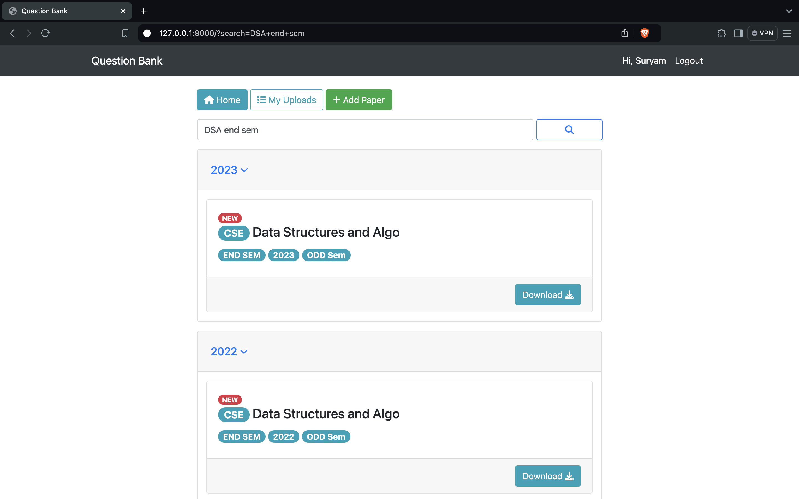

# Question Bank



## Table of Contents

- [Introduction](#introduction)
- [Features](#features)
- [Installation](#installation)
- [Usage](#usage)
- [Google OAuth](#google-oauth)
- [Technologies Used](#technologies-used)
- [Contributing](#contributing)
- [Contact](#contact)

## Introduction

Welcome to Question Bank! This Django-based responsive web application is designed to store and manage question papers
for educational institutions. It is powered by PostgreSQL Full-Text-Search for quick and efficient searching.

## Features

- **Responsive Design**: Accessible on various devices.
- **Question Management**: Add, edit, delete, and view question papers.
- **Full-Text Search**: Powered by PostgreSQL for quick and powerful searches.
- **Google OAuth**: Secure login using Google accounts.

## Installation

### Prerequisites

- Docker
- Docker Compose

### Steps

1. Clone the repository:
    ```sh
    git clone https://github.com/Suryam26/Question-Bank.git
    cd Question-Bank
    ```

2. Start Docker Daemon:
    - Ensure Docker Desktop is running.

3. Build and start the Docker containers:
    ```sh
    docker-compose up -d --build
    ```

4. Run the initial migration:
    ```sh
    docker-compose exec web python manage.py migrate
    ```

5. Create a superuser:
    ```sh
    docker-compose exec web python manage.py createsuperuser
    ```

6. Access the application:
    - Open your browser and go to `http://127.0.0.1:8000/`.

## Usage

### Running Commands

To execute commands inside the Docker container, use:

```sh
docker-compose exec web [COMMAND]
```

Replace `[COMMAND]` with your desired Django, Python, or bash command.

Example:

```sh
docker-compose exec web python manage.py test
```

### Checking Logs

To check the server logs for errors, use:

```sh
docker-compose logs
```

### Stopping the Development Server

To stop the development server and the Docker container, run:

```sh
docker-compose down
```

## Google OAuth

This project supports Google OAuth for login using the 'django-allauth' application. For activation instructions, refer
to the [django-allauth documentation](https://django-allauth.readthedocs.io/en/latest/providers.html#google).

## Technologies Used

- **Backend**: Django
- **Database**: PostgreSQL
- **Frontend**: HTML, CSS, JavaScript
- **Containerization**: Docker, Docker Compose

## Contributing

Contributions are welcome! Please follow these steps:

1. Fork the repository.
2. Create a new branch (`git checkout -b feature/YourFeature`).
3. Commit your changes (`git commit -m 'Add some feature'`).
4. Push to the branch (`git push origin feature/YourFeature`).
5. Open a Pull Request.

## Contact

For any inquiries, please contact [suryam.jain@gmail.com](mailto:suryam.jain@gmail.com).

---

**Happy Coding!**